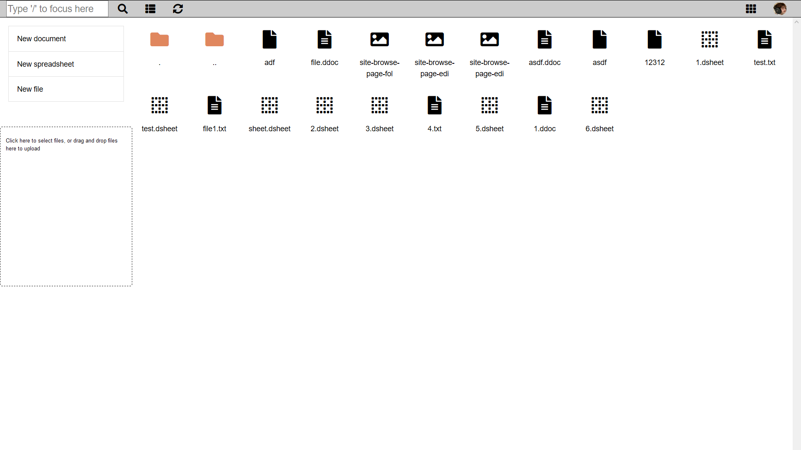
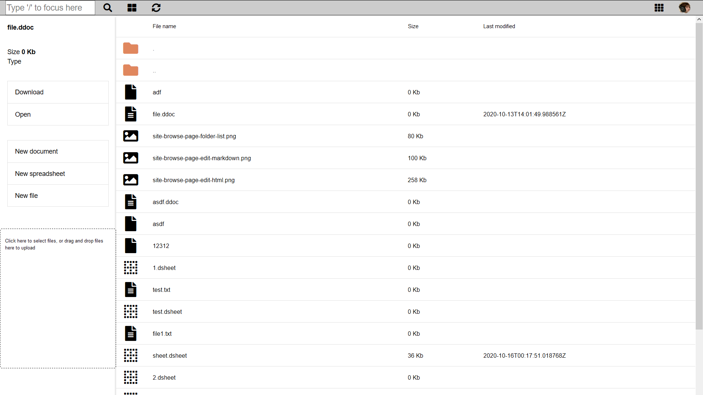

# Daptin Office Suite

An Office suite with following capabilities:

- File/folder manager
- Upload files/folders, drag and drop files
- Document editor
- Spreadsheet editor
- Calendar

# Preview

## File browser


## File browser with attributes


## Document editor


## Spreadsheet editor


## Calendar


## Calendar new event


## Calendar week view


## Install the dependencies
```bash
npm install
docker build -t daptin-office-suite
docker run -p 8081:8080 daptin-office-suite
```

### Start the app in development mode (hot-code reloading, error reporting, etc.)
```bash
quasar dev
```


### Build the app for production
```bash
quasar build
```

### Customize the configuration
See [Configuring quasar.conf.js](https://quasar.dev/quasar-cli/quasar-conf-js).
