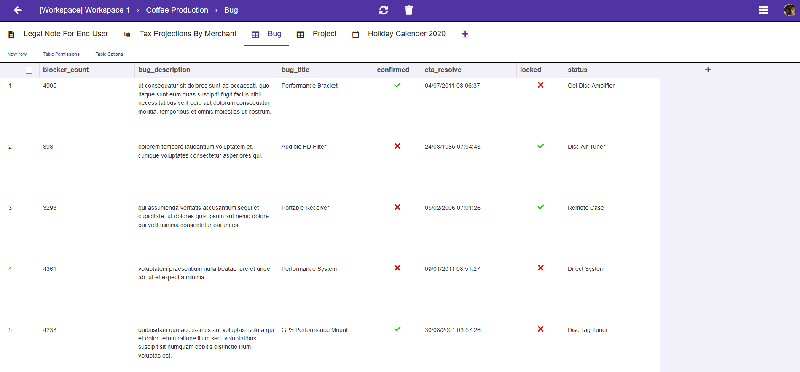

# Dadadash

## Try it now

[](https://dashboard.heroku.com/new?template=https%3A%2F%2Fgithub.com%2Fdaptin%2Fdadadash%2F)


```docker run -p 8080:8080 daptin/dadadash```

Office application suite

- File/folder manager
- Rich document editor
- Spreadsheet editor
- Calendar
- Data tables with CRUD API's


## What is inside

|      |    |
|------------------------------------------------|------------------------------------------------------|
|      |          |
|                |      |
|  |  |
|           |              |
|       |                        |


## Dev

### Build from source

#### Install the dependencies
```bash
npm install -g @quasar/cli && npm install && npm run build
docker build -t dadadash
docker run -p 8080:8080 dadadash
```

#### Start the app in development mode (hot-code reloading, error reporting, etc.)
```bash
npm run dev
```


#### Build the app for production
```bash
npm run build
```
