# Dadadash

Own and organize your content on Dadadash. 

- File/folder manager
- Rich document editor
- Spreadsheet editor
- Calendar
- Data tables with CRUD API's

# Try it now

```docker run -p 8080:8080 daptin/dadadash```

# What is inside

## Workspaces
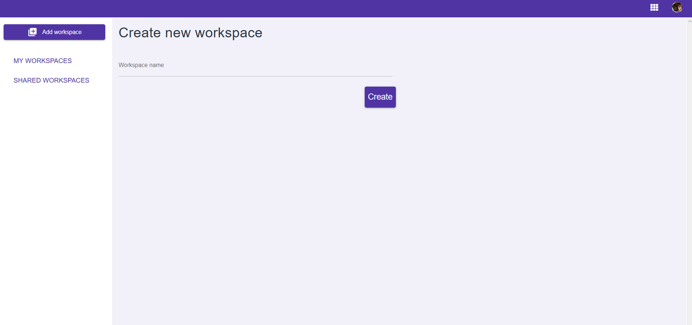
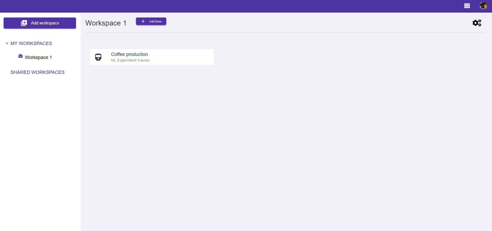
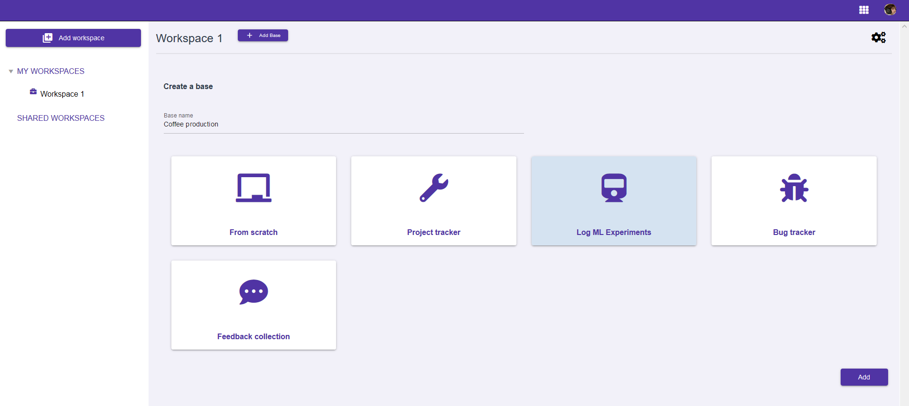

## Base
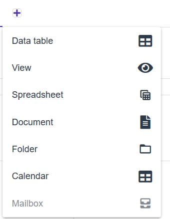

### Document editor
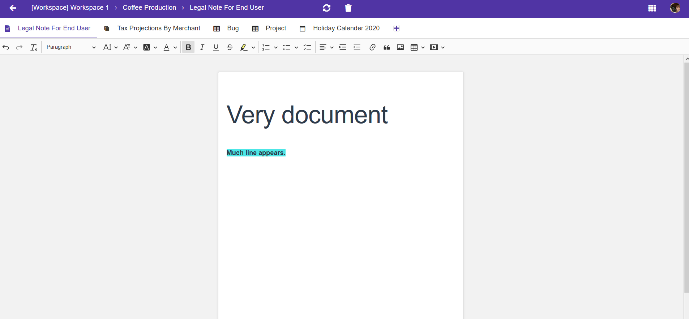

### Spreadsheet editor
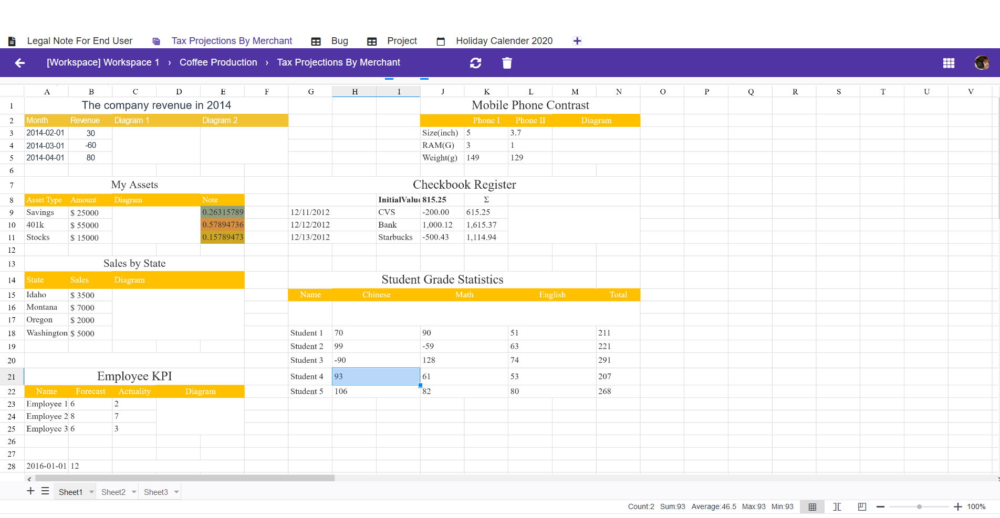

### File folder manager
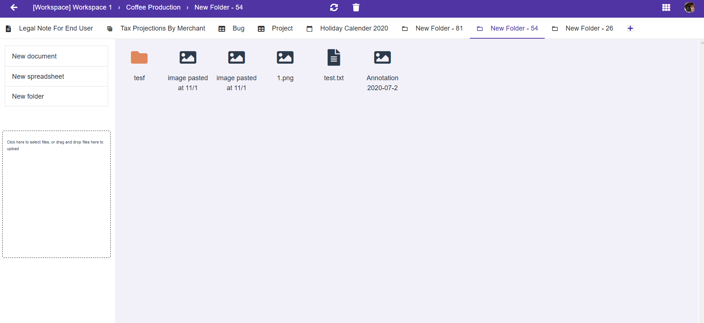

### Calendar
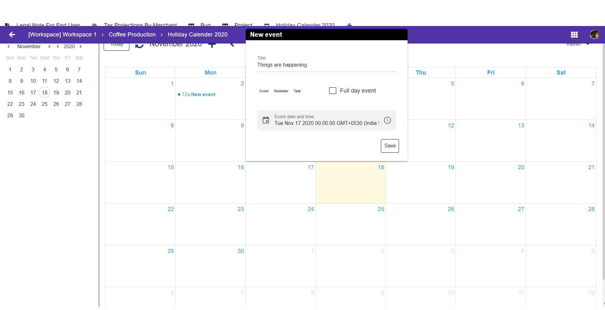

## Document editor
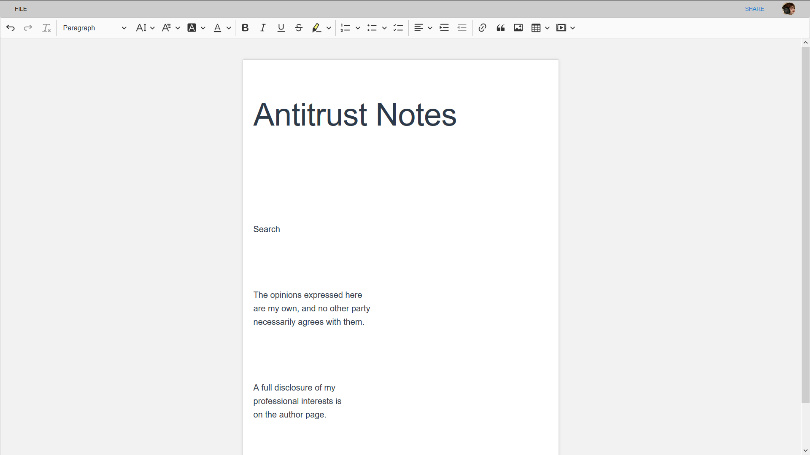

## Spreadsheet editor
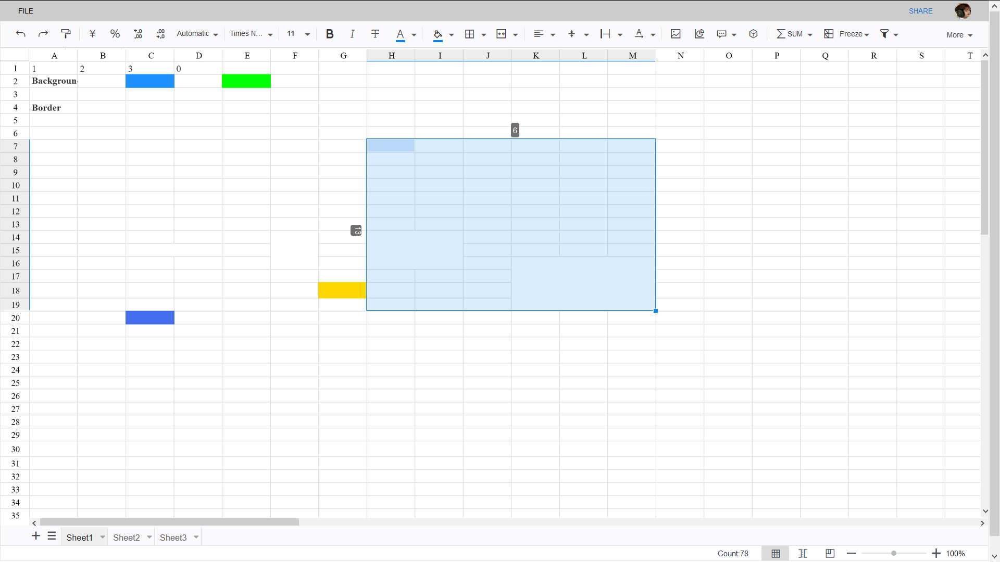

## Calendar
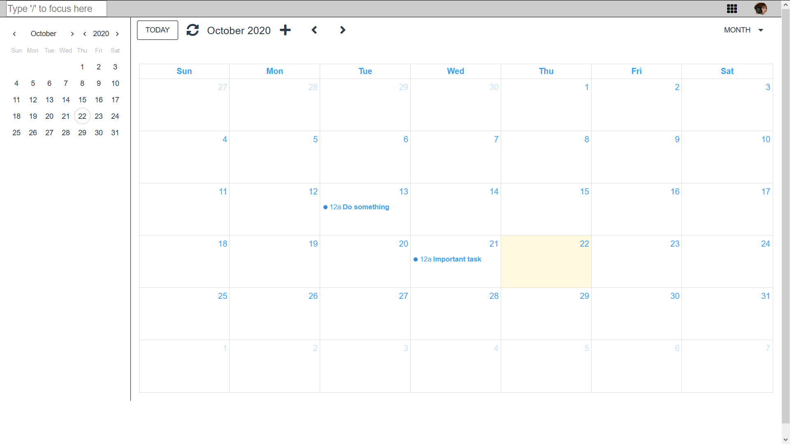

## Calendar new event
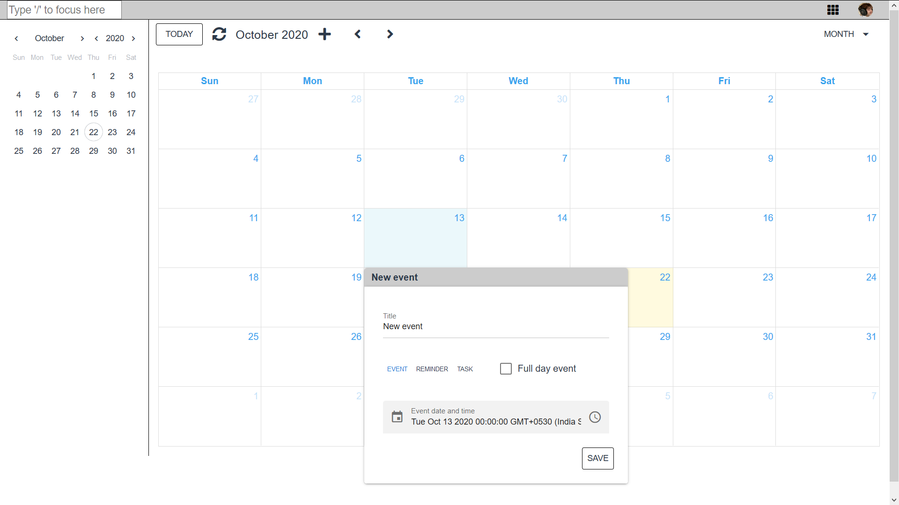

## Calendar week view
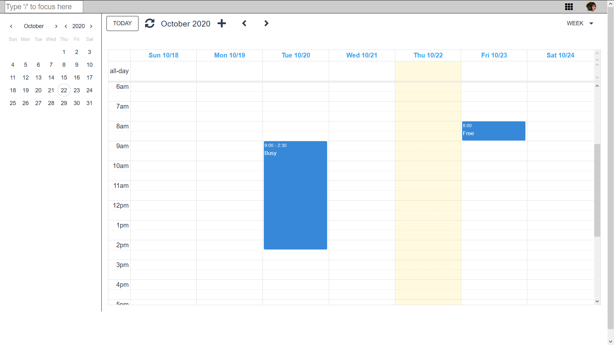


# For developers

## Build from source

### Install the dependencies
```bash
npm install -g @quasar/cli && npm install && npm run build
docker build -t dadadash
docker run -p 8080:8080 dadadash
```

#### Start the app in development mode (hot-code reloading, error reporting, etc.)
```bash
npm run dev
```


#### Build the app for production
```bash
npm run build
```
